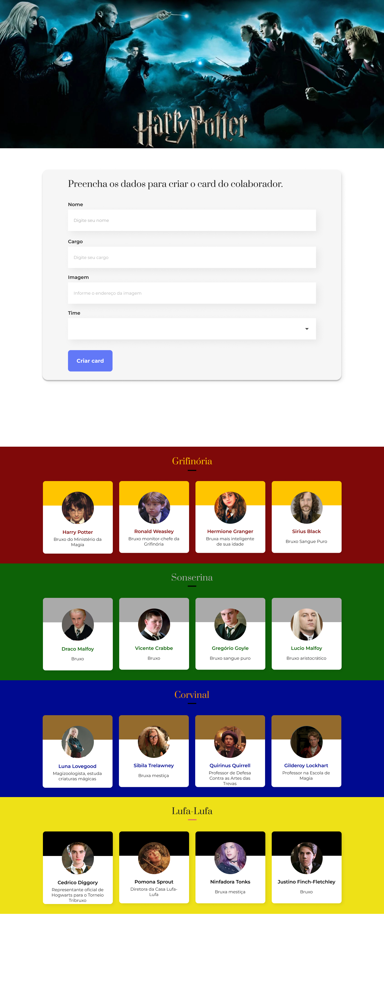

<h1> Organo - Harry Potter  🧙‍♂️ </h1>

O Sistema Organo foi desenvolvido como parte de uma aula prática de React. O principal objetivo deste projeto é introduzir e praticar conceitos essenciais de React, como:

## :dizzy: Tecnologias utilizadas

  
  
  
  
  

## :computer: Visão Geral do Projeto

### Interface do Usuário

🧙‍♂️ Temática: Harry Potter

• Criei um banner com fotos dos bruxos de Hogwarts.
• Desenvolvi um formulário para inserção de cards, cada um representando os bruxos mais importantes de cada casa.
• Organizei as casas (Grifinória , Sonserina, Corvinal e Lufa-Lufa), cada uma com suas cores temáticas baseadas na série.

## :hammer: Caracteristicas

• Componentes estáticos e dinâmicos
• Props
• Desestruturação de componentes
• Utilização de uma biblioteca declarativa
• Refatoração
• Métodos de array como map e filter
• Criação de objetos para representar times e cores de times
• Implementação do MockAPI utilizando json-server para simular dados da API.
• Adição de useEffect e os métodos GET, DELETE e PATCH.

## :mag: Demonstração

Para uma experiência completa e visual do projeto em funcionamento, você pode acessar a demonstração interativa do projeto, [clique aqui.](https://organo-murex-phi.vercel.app/)

## :open_file_folder: Como Utilizar

1. Clone o repositório em seu ambiente de desenvolvimento.
2. Abra o arquivo index.html em seu navegador preferido.

## :student: Autor

Este repositório contém o projeto Organo, desenvolvido no curso proporcionado pela Oracle em parceria com a Alura.
